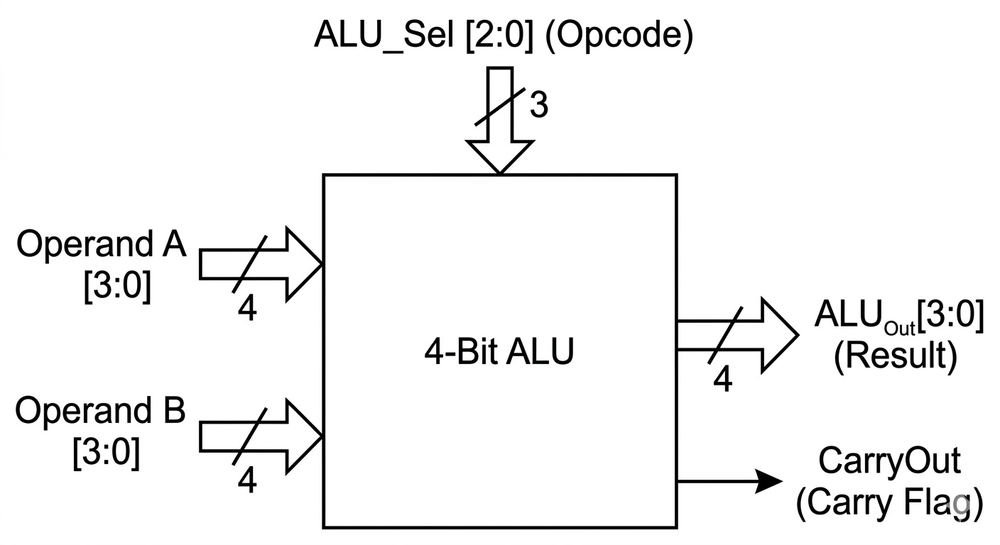
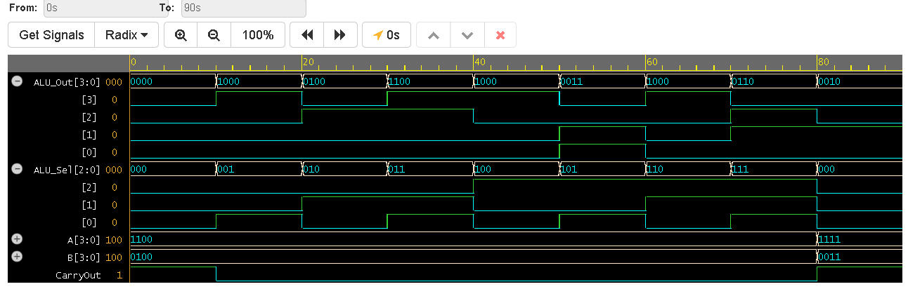

# 4-Bit Arithmetic Logic Unit (ALU)

## Overview
This project implements a 4-bit Arithmetic Logic Unit (ALU), the computational heart of any microprocessor. It introduces **Behavioral Modeling** in Verilog, utilizing `always` blocks and `case` statements to define the functional behavior of the circuit rather than mapping individual logic gates.

## Architecture & Opcodes
The ALU accepts two 4-bit operands ($A$ and $B$) and a 3-bit opcode selector (`ALU_Sel`). Based on the selector, it executes one of eight specific operations and outputs a 4-bit result alongside a Carry Flag for arithmetic overflow.

### Opcode Table
| `ALU_Sel` | Operation Name | Mathematical/Logical Function |
| :---: | :--- | :--- |
| `000` | Addition | $A + B$ |
| `001` | Subtraction | $A - B$ |
| `010` | Bitwise AND | $A \cdot B$ |
| `011` | Bitwise OR | $A + B$ (Logical) |
| `100` | Bitwise XOR | $A \oplus B$ |
| `101` | Bitwise NOR | $\overline{A + B}$ |
| `110` | Logical Shift Left | $A \ll 1$ |
| `111` | Logical Shift Right | $A \gg 1$ |

### Block Diagram

## Simulation & Verification
The testbench validates the ALU by keeping the inputs static ($A = 12$, $B = 4$) and iterating through all possible 3-bit opcodes using a `for` loop. A final test case verifies the arithmetic overflow logic by adding $15 + 3$, successfully triggering the `CarryOut` flag.

### Waveform Output

## Tools Used
* **Language:** Verilog (SystemVerilog)
* **Modeling Style:** Behavioral
* **Simulation:** EDA Playground / Icarus Verilog + GTKWave
