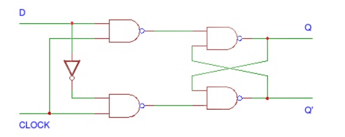
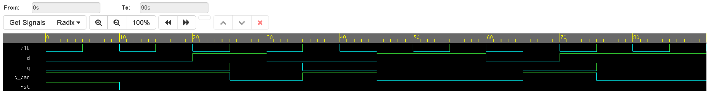

# Synchronous D Flip-Flop

## Overview
This project implements a synchronous, edge-triggered D (Data) Flip-Flop. The D flip-flop is the building block of shift registers and memory chips. It utilizes **Behavioral Modeling** in Verilog, tracking the input $D$ and passing it to the output $Q$ strictly on the rising edge of a clock signal (`clk`).

## Architecture & States
The D flip-flop ensures that whatever data is present at the $D$ input prior to the clock edge is securely captured and held at the $Q$ output until the next clock edge. It eliminates the invalid states found in SR flip-flops and simplifies the inputs down to a single data line alongside the clock and asynchronous reset.

### State Table
| `clk` | `d` | `rst` | `q (Next State)` | `q_bar` | Description |
| :---: | :---: | :---: | :---: | :---: | :--- |
| X | X | `1` | `0` | `1` | Asynchronous Reset |
| ↑ | `0` | `0` | `0` | `1` | Capture Data 0 |
| ↑ | `1` | `0` | `1` | `0` | Capture Data 1 |
| ↓ | X | `0` | `q` | `~q` | No state change on falling edge |

### Logic Diagram

*(Note: Internally, a D flip-flop can be constructed by connecting an inverter between the Set and Reset inputs of an SR or JK flip-flop.)*

## Simulation & Verification
The testbench validates the flip-flop by altering the $D$ input both synchronously and asynchronously relative to the clock edges. The simulation sequence confirms:
1.  **Reset:** An asynchronous reset initializes the output to $Q=0$.
2.  **Data Capture:** $D$ is set to $1$, and $Q$ updates to $1$ only on the rising clock edge.
3.  **Data Clear:** $D$ is set to $0$, and $Q$ updates to $0$ on the following rising edge.
4.  **Hold Function:** Changes to $D$ that occur *between* rising clock edges do not affect the output until the next positive clock edge triggers the `always` block.

### Waveform Output

*(Replace this placeholder image with your exported EPWave screenshot from EDA Playground.)*

## Tools Used
* **Language:** Verilog (SystemVerilog)
* **Modeling Style:** Behavioral
* **Simulation:** EDA Playground / Icarus Verilog + EPWave
