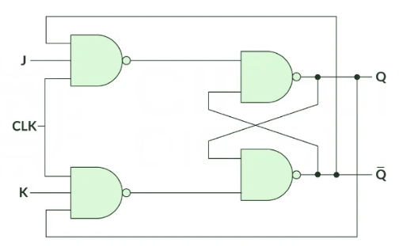
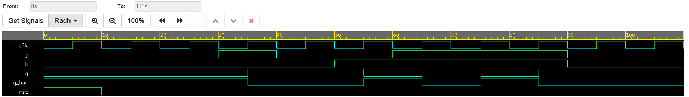

# Synchronous JK Flip-Flop

## Overview
This project implements a synchronous, edge-triggered JK Flip-Flop. The JK flip-flop is an improvement over the standard SR flip-flop because it eliminates the undefined/invalid state. By utilizing **Behavioral Modeling** in Verilog with an `always` block and a `case` statement, the design dictates the functional logic based on the clock's rising edge.

## Architecture & States
The JK flip-flop accepts two data inputs, `J` (acting similarly to Set) and `K` (acting similarly to Reset). When both `J` and `K` are held high (`1`), the flip-flop enters a "Toggle" mode, flipping its output state on every rising clock edge. An asynchronous active-high reset is also included.

### State Table
| `clk` | `j` | `k` | `rst` | `q (Next State)` | `q_bar` | Description |
| :---: | :---: | :---: | :---: | :---: | :---: | :--- |
| X | X | X | `1` | `0` | `1` | Asynchronous Reset |
| ↑ | `0` | `0` | `0` | `q` | `~q` | Hold (No change) |
| ↑ | `0` | `1` | `0` | `0` | `1` | Reset State |
| ↑ | `1` | `0` | `0` | `1` | `0` | Set State |
| ↑ | `1` | `1` | `0` | `~q` | `q` | Toggle (Invert current state) |
| ↓ | X | X | `0` | `q` | `~q` | No state change on falling edge |

### Logic Diagram

*(Note: The actual circuit typically routes the $Q$ and $\bar{Q}$ outputs back into the input NAND/NOR gates to create the toggle functionality without racing.)*

## Simulation & Verification
The testbench validates the flip-flop by cycling through all possible input combinations. The simulation sequence occurs as follows:
1.  **Reset:** An asynchronous reset sets the output to $Q=0$.
2.  **Hold:** Inputs `J=0`, `K=0` confirm the state remains $0$.
3.  **Set:** Inputs `J=1`, `K=0` drive the output $Q$ to $1$.
4.  **Reset:** Inputs `J=0`, `K=1` drive the output $Q$ back to $0$.
5.  **Toggle:** Inputs `J=1`, `K=1` are held active across multiple clock cycles, demonstrating the output $Q$ flipping between $1$ and $0$ on each rising edge.

### Waveform Output

*(Replace this placeholder image with your exported EPWave screenshot from EDA Playground.)*

## Tools Used
* **Language:** Verilog (SystemVerilog)
* **Modeling Style:** Behavioral
* **Simulation:** EDA Playground / Icarus Verilog + EPWave
