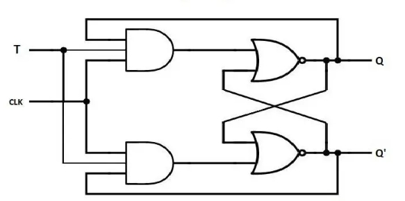
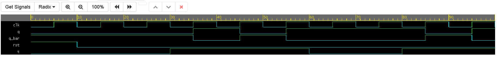

# Synchronous T Flip-Flop

## Overview
This project implements a synchronous, edge-triggered T (Toggle) Flip-Flop. The T flip-flop is highly efficient for digital counters and frequency division circuits. It uses **Behavioral Modeling** in Verilog, flipping its output state on the rising edge of the clock (`clk`) whenever the toggle input (`t`) is held high.

## Architecture & States
The T flip-flop simplifies control down to a single input line. If $T=0$, the flip-flop holds its current state. If $T=1$, the flip-flop inverts (toggles) its current state on the next active clock edge. An asynchronous active-high reset is included to initialize the circuit.

### State Table
| `clk` | `t` | `rst` | `q (Next State)` | `q_bar` | Description |
| :---: | :---: | :---: | :---: | :---: | :--- |
| X | X | `1` | `0` | `1` | Asynchronous Reset |
| ↑ | `0` | `0` | `q` | `~q` | Hold State (No change) |
| ↑ | `1` | `0` | `~q` | `q` | Toggle State (Invert output) |
| ↓ | X | `0` | `q` | `~q` | No state change on falling edge |

### Logic Diagram

*(Note: Internally, a T flip-flop is usually created by tying the J and K inputs of a JK flip-flop together, or by feeding the inverted output of a D flip-flop back into its input through an XOR gate controlled by T.)*

## Simulation & Verification
The testbench validates the flip-flop by testing both its hold and toggle capabilities across multiple clock cycles. The simulation sequence confirms:
1.  **Reset:** An asynchronous reset initializes the output to $Q=0$.
2.  **Hold Operation:** Input $T=0$ is applied, and $Q$ remains $0$.
3.  **Toggle Operation:** Input $T=1$ is held high for several clock cycles, causing $Q$ to flip ($1 \rightarrow 0 \rightarrow 1$) on each rising clock edge.
4.  **Hold Operation:** Input $T=0$ is reapplied, causing $Q$ to hold its most recent state without further toggling.

### Waveform Output

*(Replace this placeholder image with your exported EPWave screenshot from EDA Playground.)*

## Tools Used
* **Language:** Verilog (SystemVerilog)
* **Modeling Style:** Behavioral
* **Simulation:** EDA Playground / Icarus Verilog + EPWave
