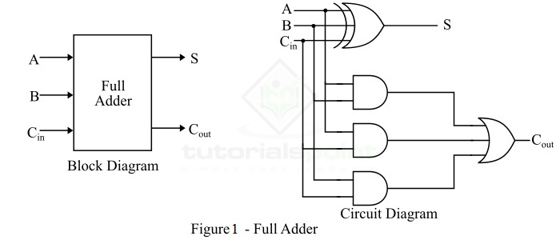

# Full Adder Design & Simulation

## Overview
This project contains the Verilog implementation and simulation of a Full Adder. Unlike a Half Adder, a Full Adder accounts for values carried in as well as out, making it the fundamental component for building multi-bit arithmetic circuits like Ripple Carry Adders.

This implementation utilizes dataflow modeling directly derived from the minimized boolean equations, rather than instantiating lower-level Half Adder modules.

## Logic Design Fundamentals
The Full Adder processes three 1-bit inputs ($A$, $B$, and $C_{in}$) to compute a $Sum$ and a Carry-Out ($C_{out}$).

The driving boolean equations are:
$$Sum = A \oplus B \oplus C_{in}$$
$$C_{out} = (A \cdot B) + (B \cdot C_{in}) + (A \cdot C_{in})$$

### Circuit Schematic

### Truth Table
| A | B | $C_{in}$ | Sum | $C_{out}$ |
|:-:|:-:|:----:|:---:|:----:|
| 0 | 0 |  0   |  0  |  0   |
| 0 | 0 |  1   |  1  |  0   |
| 0 | 1 |  0   |  1  |  0   |
| 0 | 1 |  1   |  0  |  1   |
| 1 | 0 |  0   |  1  |  0   |
| 1 | 0 |  1   |  0  |  1   |
| 1 | 1 |  0   |  0  |  1   |
| 1 | 1 |  1   |  1  |  1   |

## Simulation & Verification
The design was verified using Icarus Verilog and EDA Playground. The testbench iterates through all 8 possible input states, confirming the simulated outputs match the theoretical truth table.

### Waveform Output

## Tools Used
* **Language:** Verilog (SystemVerilog)
* **Simulation:** EDA Playground / Icarus Verilog + GTKWave
