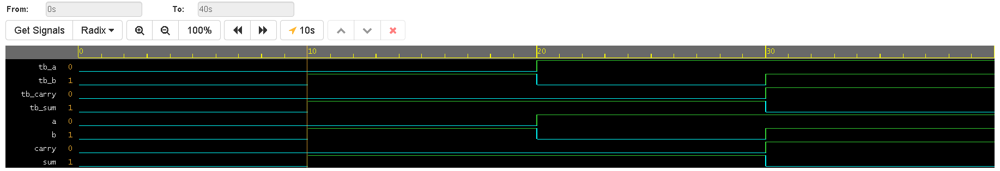

# Half Adder Design & Simulation

## Overview
This project demonstrates the fundamental design and simulation of a Half Adder using Verilog HDL. As a foundational building block in digital electronics and arithmetic logic units (ALUs), the Half Adder computes the sum of two single-bit binary inputs. 

This implementation focuses on dataflow modeling to directly map the boolean logic of the circuit to hardware descriptions.

## Logic Design Fundamentals
A Half Adder adds two input bits ($A$ and $B$) and produces two outputs: a Sum ($S$) and a Carry ($C$). 

The boolean equations governing this behavior are:
$$Sum = A \oplus B$$
$$Carry = A \cdot B$$

[Image of Half Adder logic gate circuit schematic]

### Truth Table
| Input A | Input B | Sum (S) | Carry (C) |
| :---: | :---: | :---: | :---: |
|   0   |   0   |   0   |   0   |
|   0   |   1   |   1   |   0   |
|   1   |   0   |   1   |   0   |
|   1   |   1   |   0   |   1   |

## Project Structure
* `design.sv`: The Verilog module implementing the Half Adder using continuous assignment (`assign`) statements.
* `testbench.sv`: The simulation environment that applies all possible input combinations to verify the truth table and generates the waveform data (`.vcd` file).

## Simulation & Verification
The design was simulated using Icarus Verilog / EDA Playground. The testbench successfully verifies all logic states, proving the circuit operates exactly as defined by the theoretical truth table.

### Waveform Output
*(Note: Upload the HD PNG you saved earlier into this folder, and make sure the file name matches the link below!)*

## Tools Used
* **Language:** Verilog (SystemVerilog)
* **Simulation:** EDA Playground / Icarus Verilog + GTKWave
