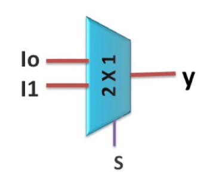
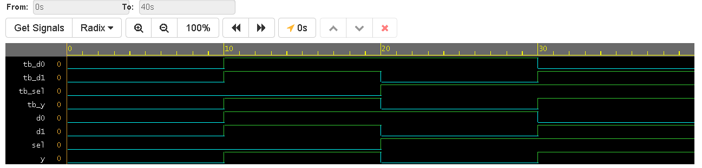

# 2x1 Multiplexer (MUX)

## Overview
This project contains the Verilog implementation of a 2x1 Multiplexer, the most fundamental digital data selector. A MUX routes one of multiple input lines to a single output line based on the state of a selection line.

This implementation utilizes **Dataflow Modeling**, leveraging the conditional ternary operator in Verilog to directly map the logical behavior to hardware.

## Logic Design Fundamentals
A 2x1 MUX has two data inputs ($D_0$ and $D_1$), one selection line ($S$), and one output ($Y$). 

The boolean equation governing this behavior is:
$$Y = (\overline{S} \cdot D_0) + (S \cdot D_1)$$

### Block Diagram

### Truth Table
| Selection ($S$) | Data 1 ($D_1$) | Data 0 ($D_0$) | Output ($Y$) |
| :---: | :---: | :---: | :---: |
| 0 | X | 0 | **0** |
| 0 | X | 1 | **1** |
| 1 | 0 | X | **0** |
| 1 | 1 | X | **1** |

*(Note: 'X' denotes a "Don't Care" condition, meaning the value of that input does not affect the output for the given selection state).*

## Simulation & Verification
The testbench verifies the routing logic by explicitly setting the unselected data line to the opposite value of the selected data line. This proves that the output $Y$ is strictly following the selected input without interference.

### Waveform Output
*(Note: Upload your waveform screenshot here and ensure it is named mux2x1-waveform.png)*

## Tools Used
* **Language:** Verilog (SystemVerilog)
* **Modeling Style:** Dataflow
* **Simulation:** EDA Playground / Icarus Verilog + GTKWave
