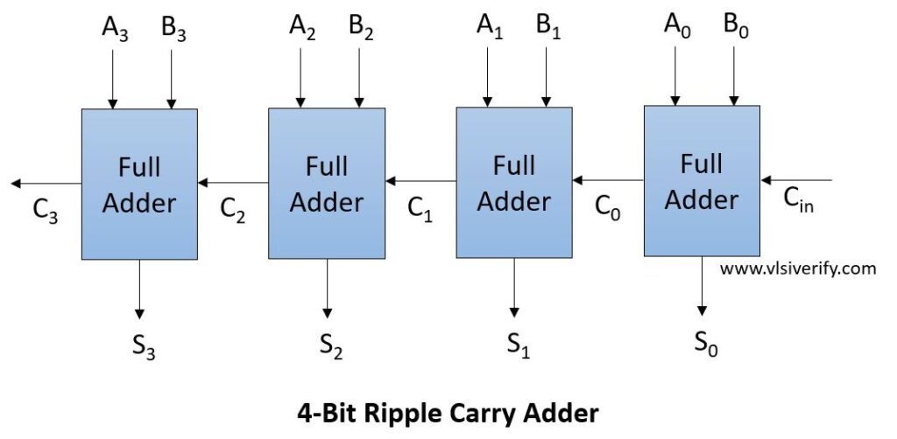
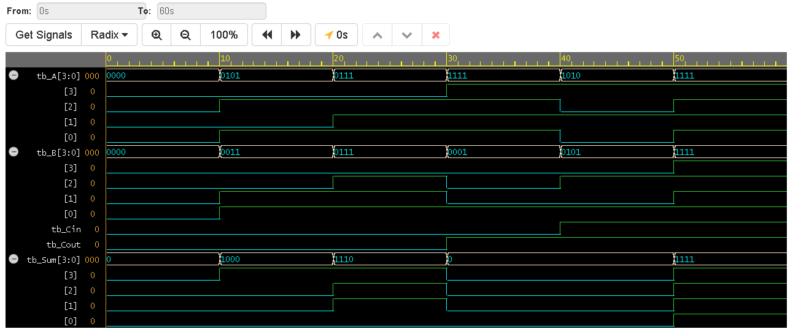

# 4-Bit Ripple Carry Adder (RCA)

## Overview
This project demonstrates **structural modeling** in Verilog. A 4-bit Ripple Carry Adder is constructed by cascading four individual 1-bit Full Adders. 

It highlights the concept of hierarchical design in VLSI, where lower-level modules are instantiated and wired together to form more complex digital systems.

## Architecture
The RCA adds two 4-bit numbers ($A$ and $B$) along with an initial Carry-In ($C_{in}$). The term "ripple" comes from the fact that each Full Adder must wait for the carry-out bit from the previous stage before it can compute its final result. 

While structurally simple, this creates a propagation delay proportional to the number of bits ($N$).

### Circuit Schematic

## Project Structure
* `design.sv`: Contains both the top-level 4-bit RCA module and the underlying 1-bit Full Adder module. Wires are used to route the carry signals between the instantiated blocks.
* `testbench.sv`: Simulates various arithmetic conditions, including standard addition and overflow cases, verifying the output in decimal format.

## Simulation & Verification
The test cases simulate the following arithmetic operations:
1. $5 + 3 + 0 = 8$
2. $7 + 7 + 0 = 14$
3. $15 + 1 + 0 = 16$ *(Generates Carry-Out)*
4. $15 + 15 + 1 = 31$ *(Max value, generates Carry-Out)*

### Waveform Output

## Tools Used
* **Language:** Verilog (SystemVerilog)
* **Modeling Style:** Structural and Dataflow
* **Simulation:** EDA Playground / Icarus Verilog + GTKWave
